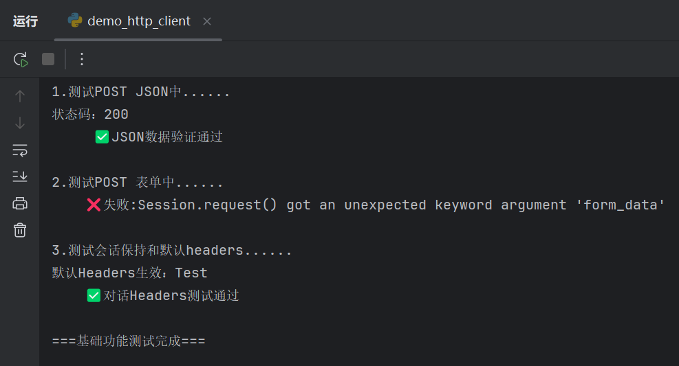
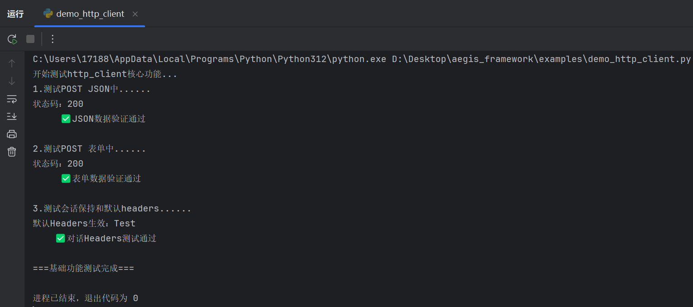
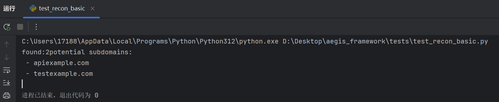
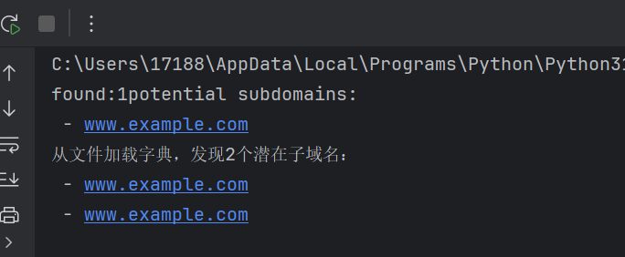
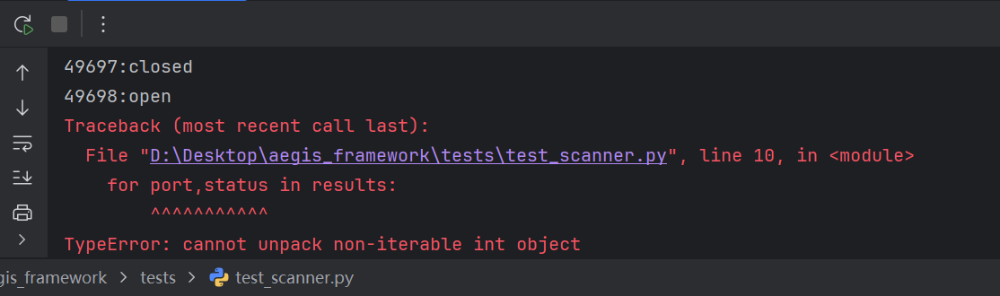
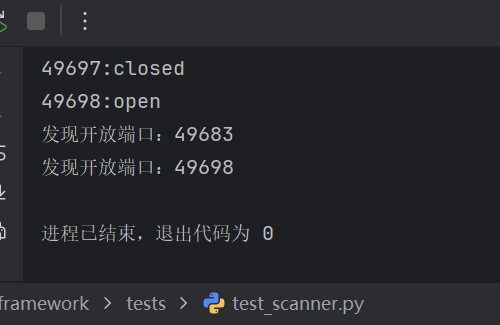
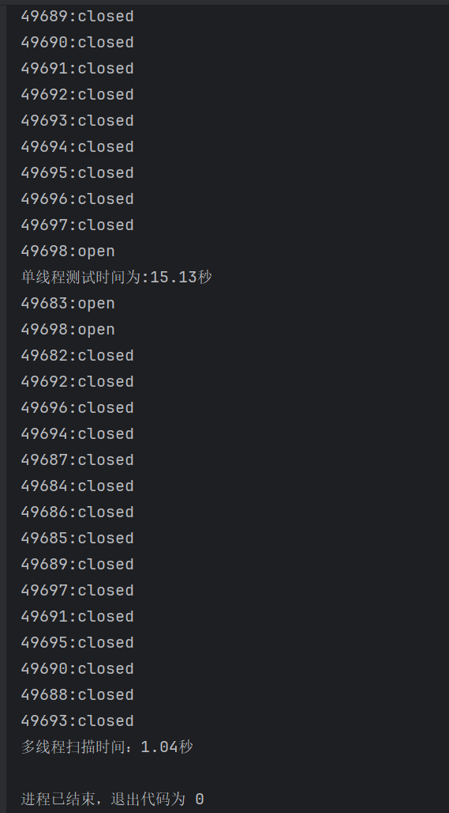
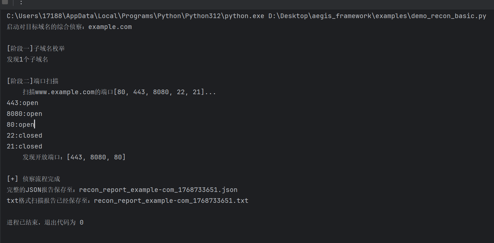

[TOC]

# **1.12**

## 建立一个基本功能的HTTPClient类，完成一个基础get功能并完成测试

- 不要总依赖 AI 迭代，有时候只是一句“请以后都这样简单回答”就解决所有问题了，对迭代而追求和 AI 思想行动高度同步是会让后期变的极为被动的，不过其好处也就是方便，更容易交流，但是缺点更严重。

- 将 `../src/core` 作为测试源代码根目录可以直接在整个项目中随时 `import`。

- 先设定一个空字典作为请求头，其中的根本原因还没有确定。

- `requests.exceptions.RequestException` 可以抛出全部异常，而 `requests.exceptions.HTTPError` 只会抛出状态码异常。try 中的异常会被此捕获，而不是优先被 python 异常处理。

------

1. **`self` 本质上的作用到底是什么，为什么 `self.response` 就会导致 `response` 实例化，就算其实例化，又有什么影响。难道是说在内存里会东一块儿西一块儿吗？**

   ​	实例就是对象的一个属性，应该是本质， 而不是被赋值后的一种可能带有混淆和残留的表象

   ​	response 更适合存在于一个方法中的操作对象， 或者说，不适合被实例化，因为被赋值会导致其有残留，好比拍了一张照片，可是因为不知道是哪一次没按到快门，不知道这张照片到底是拍的谁，在多个对象访问中容易产生困惑。

2. **默认请求头的意思，难道是说默认发送的请求是规定好的？默认请求头不也是应该有个规则吗，对不同的网站打招呼建立连接，难道还需要不同的语言？如果是需要，那怎么知道需要用的是哪种语言，如果不是，那这种固定的打招呼模式是怎么形成的（打招呼这个想法来自于今天看的计网自顶向下黑皮书 05 部分的人类协议与计算机网络协议对比图）。**

   ​	`header` 为空不代表请求头为空，而是指使用 `requests` 库中自带的默认的请求头，其存在的意义，就相当于是给有定制请求头需求的人提供一个可能的接口。

   ​	`request` 库中已经设置好了足够使用的打招呼方式，而最基本的打招呼方式是通用的。

3. **关于抛出异常，`self.response.raise_for_status()` 这句话作用到底是什么，似乎在初始版本，这句话没有必要性，原因是什么。**

   ​	并不是总需要抛出异常，因为实际上是在扫描过程中可能遇到 4??或者 3??的状况是正常的，只需要抛出 2??的结果。所以本质上这是一种业务需求，不应该存在于核心模块中。

4. **`  # 暂时直接抛出，后续统一异常处理` 的意思难道是说，将这些涉及到异常的问题，全都归于 `exception.py` 中吗？初始阶段为了方便测试，先暂时抛出。实际上在这里最终是不需要这一部分的。**

   ​	和前者的答案一致，异常处理是业务需求。

5. **我看到在 `try` 和 `exception` 之后，用到了 `raise`，这个是什么意思**

   ​	`raise` 相当于是等于接受了前者抛出异常这个情况，但是不做处理，如果有需求可以在此处修改。

6. **在 `response = requests.get(url, headers=self.headers, **kwargs)` 中，关于 `headers=self.headers`，这个可能是对之前 `self.header` 对象的使用地点，这个地方，有多种理解，但是不知道正确的是什么，关于 `**kwargs` 这一部分，之前就研究过，但是忘记了。**

   ​	`header` 就是前面讲的，对定制需求的接口，默认是 `self.header = {}` 中定义好的。

   ​	`**kwargs` 相当重要，相当于是用户有其他定制需求可以直接添加参数，而不需要设计者在初始函数里就定义好一个一个的形参。但是用户要注意如果可能，要确保参数不会混淆，可以用参数 = 参数值来使用参数。

# 1.15

## 完善 `post` 方法（支持 JSON 和表单数据）并且添加会话支持。

- 先不考虑异常抛出的各类业务需求，而是先完成一个标准模式的异常抛出模板。

------

1. **为什么json_data中用双引号，而在client输入header参数时用的是单引号？**
   	json中严格使用双引号区分字符串和非字符串，而在python中单引号和双引号是等效的，有时用什么符号，是要看是否影响转入到json中的转义，一切为了方便省事。

2. **在测试代码中使用：`sys.path.insert(0,os.path.join(os.path.dirname(__file__),'src'))`的目的是什么。**
   	这是一种引入核心模块的方式。不过在此项目中，我的测试文件并不在根目录，所以这句话没有起到作用，一切可以正常运行是因为我已经把核心模块添加进测试源代码根目录。

3. **`assert`函数所起的作用是什么，难道单纯就是一个快捷的判断语句吗？**
   	`assert`是更严重的判断，是对一个客观上必须为真的事实的再次敲定，意料之外的后果并不是简单返回一个布尔值，而是中断程序，因为这种错误在根本上违反了程序设计初衷。同时，这种严格性也保证了工程上直接切断了隐性错误被忽视导致的复杂溯源问题，大大降低了可能的后期调试成本。

4. **为什么在测试POST的表单功能时，相比于测试JSON功能，这次并不需要自定义请求头呢？难道说演示中所使用的请求头自定义只是此功能的一种演示，而非具体功能吗？**
   	确实只是对自定义header这种业务需求的演示。
5. **为什么在表单测试中，使用`returned = resp.json()`，而不是`returned = resp.form()`,难道说，这里其实只需要整个post中的json格式，而从中寻找表单吗，不理解，这似乎和网络报文的整体框架格式有关。**
   	JSON和json不是一个东西,前者是格式，后者是字段。响应体可能是任何格式，而在此次测试中返回JSON格式，从中寻找form或者json段。

6. **测试会话保持中，`client = HTTPClient(default_headers={'X-Custom-Header': 'Test'})`其中的写法什么意思，就像是定义了一个参数名和一个参数值作为表单头吗？**
   	相当于是提供了一个宗门令牌，至于这个令牌是进藏书阁还是长老殿，具体功能待定。不过有此令牌，日后若有需求，只需规定即可，无需开启工坊制作令牌，省了一番功夫。

------

测试结果：

原因是在表单测试中，对于post参数，使用了`form_data`而不是`data`，因为在post中，表单的标准参数输入模式是`data = form_data`。

修改后：

# 1.16

## 设计一个最小的可验证的，子域名枚举器，作为模块文件

------

1. **引入了`asyncio`库，说是要为未来的并发操作考虑，那么其具体作用是什么呢。**
   	`asyncio`库可以让在请求等待的同时，发送下一个请求。从而达到可以同时发出数百个请求（子域名，端口）。

2. **`http_client:HTTPClient = None`这在`__init__`中，也就是一个函数参数中， 是什么样的写法，一般什么时候会用到？**
   	暂时表面上是，“依赖注入”，可以将一个配置好的整个客户端当作参数输入，不传入就使用默认实例。至于其他的用途如何用到这个，暂时搁置。

3. **`self.wordlist`在参数名中未指出，为何此处可以直接使用？**
   	这一点，忘记了，确实是实例化属性的标准操作。但是此前和`__init__`后面的参数做了混淆。这一点上，更好的理解是：字典本来就应该是一个完整的子域名枚举器的固有属性。

4. **赋值过程中使用`or`的原因是什么，比如`http_client = http_client or HTTPClient()`。**
   	如果http_client存在，就将其做客户端，如果不存在，那么就等于HTTPClient()，相当于是创建了一个实例化对象。

5. **` def enumerate(self, domain: str) -> List[str]:`这个形式和正常的函数命名格式有挺大区别，具体含义是什么？**
   	前者是正常的函数命名，输入字符串，返回输出字符串列表。明确说明此函数意图，方便后期处理（IDE补全和自检）。

6. **在`enumerate`函数中，`for sub in self.wordlist: candidate = f"{sub}{domain}"`，这种循环的方式，在之前的场景中没有见过，算是python语法的一种快捷写法吗。**
   	算是吧，candidate是对wordlist中的描述，而f后面的正是对字符串处理的一种新模式。

7. **`sys.path.insert(0,os.path.join(os.path.dirname(__file__),'src'))`这句话之前就出现过类似的用法，是否是相当于将目标目录添加到测试根目录。通过查询，我发现这串代码实际上是两部分的结合，一部分获取当前目录，另一个部分添加对于格式到`sys.path`下。而我的测试文件真实路径实在tests文件夹下，而tests文件夹才位于根目录，所以中间需要加`'..'`来达到上一步的目的，而进入src目录下，下面from导入目录也需要从src开始。**

   ​	正确的。

8. **从一个域名获取到其可能的子域名，在底层是如何实现的。更进一步，在此子域名枚举器中是如何实现的。**	

   ​	问这个问题，其实是不知道域名是什么，域名是高级域(子域)....二级域SLD.顶级域TSD。而子域名枚举器，指的便是二级之前的部分，二级域加顶级域，就是主域名，高级域的排列组合就是需要枚举部分。欸，这样也不对，实际上子域名，指的是高级域的排列组合加主域名，才叫主域名。

   ​	

------

这个example.com难道是专门用来测试这类子域名枚举的网站吗，感觉比较神奇。

提出上面那个问题，正式因为没有理解问题8导致的困惑。由此还发现，测试example.com的子域名时，前面忘记加`.`了。

## 子域名枚举器深入——从文件加载字典  

------

1. **`with open(...) as f:`** 这种写法的好处是什么？（对比 `f = open(...)` 和 `f.close()`）

   目前只想到是`f`被赋值后，如果字典本身比较大，而`f`的存在就会导致内存常驻没法得到释放，其实这里还是不清楚详细的操作。

2. **`line.strip()`** 去除了哪些字符？为什么需要它？

   去除了开头和结尾的空格和换行，对字典掐头去尾，防止漏过第一个前面带空格的子域名，或者最后子域名中掺了空格或者换行。

3. 异常处理中，为何选择**直接抛出** `FileNotFoundError` 而不是静默回退到默认字典？

   因为如果退回静默字典，会无法判断是否已对计划中的字典域名进行枚举扫描，误以为只有默认字典中的少数子域名。

4. 最后的 `if not wordlist:` 检查是防御什么情况？

   防止字典文件中是空字典，而无结果，导致错误认为没有子域名。

5. `try...except` 在这里捕获了哪些异常？为什么要分开捕获？

   捕获了文件不存在于测试文件根目录以及字典文件无效的异常，分开捕获便于快速处理异常。

6. 如果 `test_wordlist.txt` 不在当前目录，如何指定路径？（例如：`"assets/wordlists/common.txt"`）

   使用相对路径或者绝对路径吧。但是不知道这是否会和文件名称相冲突，比如文件名就叫做“`assets/wordlists/common.txt`”。

   

------

成功运行使用默认字典和从文件中读取的字典

但是如何确保从文件中读取是有效的呢，我打算在字典中再加入一行www进行测试，预估应该产生两个潜在子域名，结果相同。

说明测试结果成功，代码有效。

# 1.18

## 设计一个端口扫描器1.0，作为模块文件

------

1. `socket`库是做什么的，用于这个插件中是怎么考量的？

   `socket`是python提供的一个相对底层的接口，和http协议无关，直接用于端口的测试。

2. 这个项目从0开始，是如何构建出来整体架构想法并可以分解落实的，从0到1的整个树状思维结构是什么，如何体现这个思维的通用性？
   这个问题的回答在认知卡部分。

3. `results[port] = status`这一步就相当于是将port添加进了只用`results = {}`定义的`results`中吗？
   这是字典内部添加键值对，字典扩充的标准写法。

4. `print(f"{port}:{status}")`在scan函数中，对应的这一部分到底起什么作用，难道不是只需要这个函数的返回值，也就是results就行吗，这一步打印是不是画蛇添足了。
   站在用户角度考虑，这个打印提供了视觉上的反馈，让用户更清楚的看到整个程序运行过程，而避免了只看到结果而对过程产生怀疑性。

5. 关于"[]"，"{}"，"{[a]:[b]}"这种结构，这种类似的结构体，其大家族和分类分别是什么。
   []是列表list，有序，用索引访问，{}是字典，本质是键值对组，通过key访问（问题就来了，是否存在三元一组的这种字典？能否通过值访问，单一的一个元组，其格式必须统一吗。）()是元组，tumple，其值无法改变，{}集合set，无序，一般用于去重和关系测试。

6. `results.items()`的用意。

   将`results`这个字典中的键值对成对处理，而不是单一的检索其中的某个`key`。这一般是python中遍历字典的惯用方法。

------

运行时正常，但是最后统计开放端口时，发现报错，原因是`for port,status in results:`这一步中，`results`应该为`results.items()`
具体写法还不知道为什么。

修改之后一切正常：

## 端口扫描器深入——多线程，并发

------

没有什么问题，因为多线程操作之最之前就使用过，这一次使用，更明白了线程池的使用方法。

1. **`max_workers` 设置为多少合适？** 是不是越大越快？这和你电脑的CPU核心数、网络带宽有什么关系？
   设置10(2.08)，50(1.04)，100(1.02)，200(1.02)。感觉和cpu核心数和宽带有关，并发操作相当于把多个单线程累加，其占用cpu和网络几乎是`max_workers * 单线程资源占用`,因此不是越大越好。
2. **`executor.submit` 和 `future.result()` 在这里分别扮演什么角色？** 这种“提交任务-获取结果”的模式，是否可以抽象成一个通用工具，放入 `src/utils/`？
   `executor.submit`我感觉像是将单线程对象（操作函数，操作参数）摆放到线程运行池这个大函数中，`future.result()`就是线程池中第一个跑出来的单线程输出结果,这种模式，确实可以抽象为一种固定的模板工具中。
3. 对比串行版本，并发版本的输出顺序还是按端口顺序吗？为什么？这个特性对用户体验重要吗？
   不是按照端口顺序，这个特性对用户体验，至少说这个功能上，我认为是比较好的，用户无需一直等待，而可以优先立马看到最先完成部分是哪个端口。但在有的场合下，可能不符合用户体验，比如用户对输出格式有要求的，需要拿来进行下一步有序输入。

------

测试结果为：

看到加入线程池后，扫描速度明显快于单线程（15.13秒），优化速度显著（1.04秒）。

## 创建综合侦察演示脚本

------

`sys.path.insert(0,str(Path(__file__).parent.parent))`的使用，以及对`pathlib`库中`path`的引用，是怎么实现确保模块导入的。之前是用`sys`和`os`配合完成相对路径的书写。

遇到了一个扫描器的传参问题，已解决。

------

