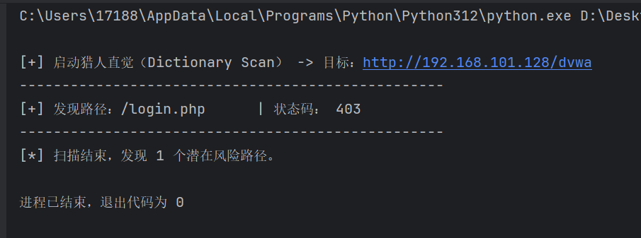
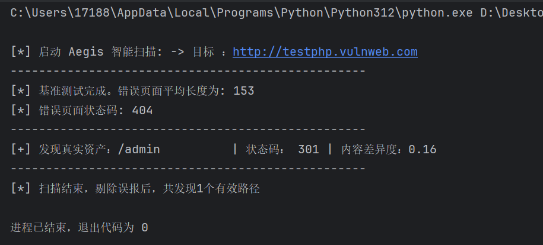

[TOC]


# 1.24

## 设计一个最小的可验证的敏感路径爆破插件。

今天开始明显感觉前面的python基础开始内化，分析代码逻辑的速度变快。

------

1. `allow_redirects=False`的作用是什么？

   禁止HTTP请求中的重定向，这样的话，目的就仅仅是为了检测连通性，不过不知道这样做，在某些场合下，是否可以规避检测或者说因此被检测。因为这似乎不符合常规的业务流程。

2. 遇到了Docker虚拟化未启用的问题

   解决办法是打开**`optionalfeatures`**，然后启用：

   - **虚拟机平台 (Virtual Machine Platform)**

   - **适用于 Linux 的 Windows 子系统 (Windows Subsystem for Linux)**

------



因为时间问题，docker问题暂时没有解决，没办法测试Juice Shop，于是打开vmware，对Dvwa靶场进行了测试，检测出了`/login.php`目录，`login.php`是临时添加的。目标：`target_url = "http://192.168.101.128/dvwa"`，显示：[+] 发现路径：/login.php      | 状态码： 403

# 1.25

## 敏感路径爆破深入——破除“特定返回页”障眼法

想要破除这个障眼法，一种手段就是“基准测试法”，将一个随机错误的请求返回与正确的测试请求返回进行比对（用`difflib`库）。

------

1. `return None, None`是个什么用法？

   返回两部分内容，因为这个函数要同时返回状态码和内容。

   这算是python的一种语法糖，并非返回两个输出，而是返回一个元组`tumple`:`（None,None）`

   而返回`None`则是**防御性编程**的一种体现，就是为了防止没有正常返回结果导致错误的`return`，从而影响编译结果。所以网络错误就按照`None`来处理。

2. 对于以下代码（随机字符串）：函数内部的两句话的必要性是什么，比较巧妙的一个函数。

   ```python
   def get_random_string(length = 10):#这里是否可以认为是可以使用_来对函数名开头，代表自用函数
       """生成随机字符串，用于探测 404 特征页面"""
       letters = string.ascii_lowercase + string.digits
       return ''.join(random.choice(letters) for i in range(length))
   ```

​	`join`在其中起了核心作用，而上面的两部分相加，是把小写字母和0~9组合，形成一个随机池，`join`可以降低复杂度，先完成后面的组合部分，再`join`进`return`，少了一步嵌套。

------



结果：测试了第二遍成功，第一次因为`get_page_content`函数中的返回值忘记写了没有正常编译，修改之后正常。

思考：比较的内容差异度，0.16似乎也不算高，这个尺度到底应该怎么把握？
