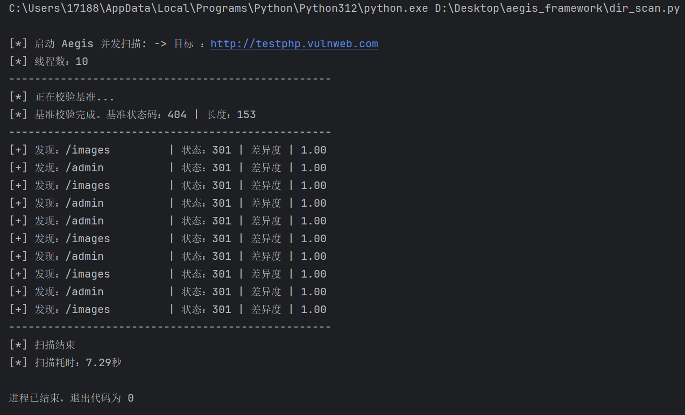

[TOC]


# 1.24

## 设计一个最小的可验证的敏感路径爆破插件。

今天开始明显感觉前面的python基础开始内化，分析代码逻辑的速度变快。

------

1. `allow_redirects=False`的作用是什么？

   禁止HTTP请求中的重定向，这样的话，目的就仅仅是为了检测连通性，不过不知道这样做，在某些场合下，是否可以规避检测或者说因此被检测。因为这似乎不符合常规的业务流程。

2. 遇到了Docker虚拟化未启用的问题

   解决办法是打开**`optionalfeatures`**，然后启用：

   - **虚拟机平台 (Virtual Machine Platform)**

   - **适用于 Linux 的 Windows 子系统 (Windows Subsystem for Linux)**

------


因为时间问题，docker问题暂时没有解决，没办法测试Juice Shop，于是打开vmware，对Dvwa靶场进行了测试，检测出了`/login.php`目录，`login.php`是临时添加的。目标：`target_url = "http://192.168.101.128/dvwa"`，显示：[+] 发现路径：/login.php      | 状态码： 403

# 1.25

## 敏感路径爆破深入——破除“特定返回页”障眼法

想要破除这个障眼法，一种手段就是“基准测试法”，将一个随机错误的请求返回与正确的测试请求返回进行比对（用`difflib`库）。

------

1. `return None, None`是个什么用法？

   返回两部分内容，因为这个函数要同时返回状态码和内容。

   这算是python的一种语法糖，并非返回两个输出，而是返回一个元组`tumple`:`（None,None）`

   而返回`None`则是**防御性编程**的一种体现，就是为了防止没有正常返回结果导致错误的`return`，从而影响编译结果。所以网络错误就按照`None`来处理。

2. 对于以下代码（随机字符串）：函数内部的两句话的必要性是什么，比较巧妙的一个函数。

   ```python
   def get_random_string(length = 10):#这里是否可以认为是可以使用_来对函数名开头，代表自用函数
       """生成随机字符串，用于探测 404 特征页面"""
       letters = string.ascii_lowercase + string.digits
       return ''.join(random.choice(letters) for i in range(length))
   ```

​	`join`在其中起了核心作用，而上面的两部分相加，是把小写字母和0~9组合，形成一个随机池，`join`可以降低复杂度，先完成后面的组合部分，再`join`进`return`，少了一步嵌套。

------


结果：测试了第二遍成功，第一次因为`get_page_content`函数中的返回值忘记写了没有正常编译，修改之后正常。

思考：比较的内容差异度，0.16似乎也不算高，这个尺度到底应该怎么把握？

## 敏感路径爆破深入——增加并发

------

1. 为何要将`baseline_content = None`作为全局变量，难道是因为如果放在函数内部，会多一步调用，从而增加复杂度吗？

   不然会在每一次单线程中执行一次，增加了繁琐度。

2. `for _ in range(10)`这一步是怎么回事，似乎和前面正常循环不一样

   python老鸟的代号，表明这个变量我用了就丢，反正是循环十次。

3. 为什么在线程池中使用了`global baseline_content`来声明，但是单线程中没有，因为单线程那个函数`check_one_path`会被线程池调用，因此那里也会使用全局变量。所以`baseline_content`在单线程中出现的`if`判断其逻辑值也就好解释了，因为要参照下面线程中的内容。

   **如果修改全局变量就需要些，只读取的话不需要**

------



结果：一切正常，平均1.4秒10扫十个目录，线程为50，结果为1.76秒，差不多吻合。线程受制于网络能力和电脑性能，并非越大越好。

思考：为什么之前单线程，差异是0.16，这一点上，差别是有点多。难道是差在之前那个问题2上吗，这一步影响了随机字符生成，而且之前单线程测试用了两个部分，我想是出于严谨，而在此，直接测试，是为了测试方便吗？

补充：

- **GIL 锁**：python的单线程实际上是伪单线程。线程太多会产生锁竞争。
- **网络拥堵**：网卡和目标服务器带宽有限，线程多产生网络拥堵。
- **上下文切换**：线程多了导致cpu的上下文切换成本在单位时间内变高。

# 1.27

## 解决docker虚拟化不成功问题

本次产生这个的原因是雷电模拟器9.0的虚拟化修复，和docker本身的虚拟化要求产生了冲突。

------

1. Docker的“欺诈”，指的是Docker底层内核对内部进程的欺诈，还是对外部操作系统内核的欺诈？欺诈的根本目的是什么？

   我现在能答出来的，就是更像是Docker设计本身是为了欺骗内部进程，像是楚门的世界。这么做的目的是为了将不同的东西，打包，放到一个生态缸中，而这个生态缸并不完美，因为他不能直接操控外部真实世界，还需要外面大生态中的人为参与，来给内部提供所需要的硬件支持。不过外部也是个生态罢了。

2. Aegis应该在容器的内部还是外部？

   按照需求来，如果是为了分享工具求职演示，那么在内部，除此之外，在内部，也相当于多了一层防护，在被溯源时，这个容器本身的限制就变成了对外部溯源人员的欺诈层，除非他们识别出来身处容器并完成容器逃离，所以在便携性和安全性上，会选择生态缸内部，也就是代理模式，不过这里指出的代理模式和无代理模式，我不知道问出这个问题的初衷时什么，难道说，这里的代理无代理，指的是Aegis内部的逻辑构造的方式？但是既然被欺骗，那么对他而言，内部网络和外部网络不是一样的吗，难道是说，是因为他触摸不到第一手的真实信息，所以使得问题全都变复杂了？

# 1.30

## （续）解决docker虚拟化不成功问题

------

1. Docker和雷电模拟器产生了需求上的冲突，核心原因是什么，对应冲突部分在docker和模拟器上面起的作用本质上是什么，是否具有必要性，起源又如何？

   核心原因是二者争夺Hyper-V，而模拟器修复方案是关闭Hyper-V，采用性能更快的cpu直连模式。在docker中采用的是linux内核，模拟器则是采用了linux内核+x86/ARM架构，即为操作系统（OS），那么其直接操作硬件的需求在软件层面无法得到满足，而通过纯软件模式翻译，来简介实现对应的功能， 效率又相当之低，没法满足生产需求，因此诞生了Hyper-V技术，在原生操作系统独占ring-0的情况下，硬件开发时开辟ring-1来给有此需求的虚拟机，提供VMX root服务，但是，面对多虚拟机，以及套娃问题，VMX root的方式，显然不足以满足实用需求，因此现代的解决方式是用API的方式，在应用产生操作系统级别的需求时，直接调用接口而不是在当下环境中“硬请求”。不过这也因软件需求而异，比如Docker依然是独占Hyper-V。

   不过我的理解还需要再次纠正一下：Hyper-V是软件，是用户，并非等于权力，他只是因为住在了ring-1（硬件区域，皇宫），享有VT-x或者AMD-v（功能区域，皇权）的直接使用权，而Docker支持Hyper-V上位，因为可以直接使用Hyper-V提供的WSL2服务，而其他虚拟机（雷电），不愿意这么干，他们觉得直接操作cpu更快，所以想独占ring-1，直接使用VT-x或者AMD-v。但是如果开启兼容模式，相当于通过API，他们也得通过Hyper-v提供的服务，来接受不得不慢一点完成服务的现实。

2. 现在的问题就进入了微观操作层面，因为之前雷电模拟器的修复操作，导致我的windows功能中的虚拟机平台（或许是Hyper-v提供的WSL2虚拟机平台？如果那个被关了，说明要么就是WSL2被截胡了，要么就是Hyper-v这个皇帝被人赶下位了，但是我看到雷电模拟器还提示需要修复，那有可能他自己还没拿到VT-x权限，说明现在ring-1位置可能空了，所有服务都通过软件方式来请求cpu，进行低效运作），但是任务管理器中我看到cpu的虚拟化功能，是启用的，所以我不确定是这个“眼睛”坏了，还是Hyper-v还在位置上，在启用状态，但是WSL2服务被单独关闭。

   任务管理器这个“眼睛”盯着的，是皇权是否存在，无法通过这个来判断皇帝在不在，可能是VBS（windows安全内核）在继续完成转发。

3. 但是目前尴尬的就是，皇位有人坐着，但可能是VBS，Hyper-v可能被关了，然后在windows服务中只能看到适用于Linux的Windows子系统和虚拟机平台，没看到Hyper-v，而且用于Linux的Windows子系统是开着的，但是虚拟机平台是关着的，而我尝试打开并在线下载虚拟机平台功能时，系统卡到一半一点就下载不动了。

   


------

